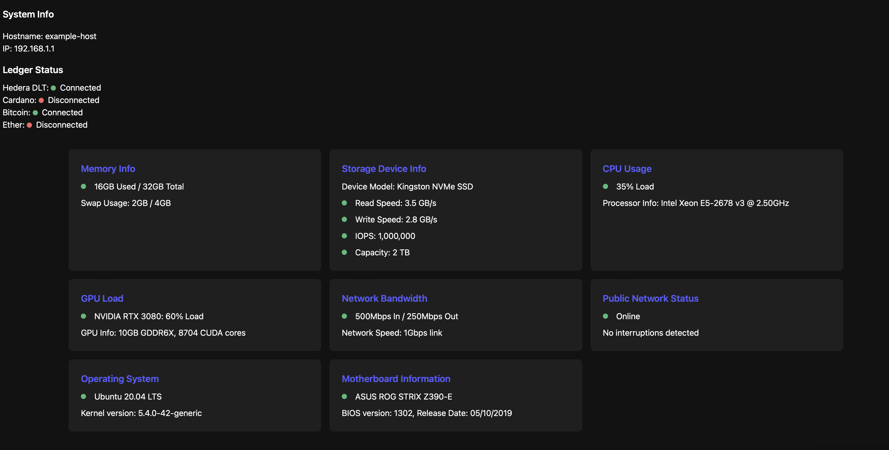

# crayoneater-rs: The Scalable Enterprise Hardware Performance Benchmarking & Diagnostic Kit


## Available Features:
- Real-time system metrics in-browser
- CPU and RAM stress tests

## Upcoming Features:
- GPU and Network stress tests
- AI-assisted system characterization
- In-browser result visualization

### **Are you fully utilizing your hardware infrastructure's potential?**

### **Are you overspending on GPUs or other hardware because you don't know exactly what your stack needs to perform?**

crayoneater-rs is a web-based and CLI toolkit engineered to enhance performance and reliability in enterprise hardware infrastructure. This toolkit is the culmination of my 8-year journey in enterprise SaaS in California and the Pacific Northwest, fused with skills honed during my 8 years as a US Marine.

## Real-Time System Diagnostics via WebAssembly


### Ultra-Low Resource Utilization and Latency

Developed in Rust, crayoneater-rs takes advantage of WebAssembly (Wasm) to offer real-time performance and health monitoring with minimal overhead. This integration ensures resource-efficient, low-latency diagnostics directly in your browser.

### Addressing Core Enterprise Concerns

- **Performance versus Expenditure**: Ensures your investment in hardware is optimized for peak performance.
- **Power Consumption Optimization**: Identifies potential savings and environmental impacts through power efficiency enhancements.
- **Memory Configuration Integrity**: Validates reliability and stability in mixed memory configurations.
- **Storage Longevity**: Provides projections on storage device lifespan, aiding in timely upgrades.
- **NIC Performance Validation**: Ensures network interfaces perform to vendor specifications.
- **Thermal Efficiency**: Assesses and mitigates risks of thermal issues to maintain reliability.

```console
kennethsheridan@Kenneths-Macbook-Prolocal crayoneater-rs % ./crayoneater-rs --help 

Detailed instructions for hardware performance analysis and diagnostics. Supports a range of tests including benchmarks, stress tests, and system discovery to unveil your hardware's full capabilities.
```

### Why Rust and WebAssembly?

- **Predictable Performance**: Rust's efficient handling of system resources ensures reliable performance for critical tests.
- **Concurrent Processing**: Manages multiple data streams effectively, thanks to Rust's advanced concurrency features.
- **Safety and Security**: Minimizes common runtime errors through Rust's strict type system and ownership model.
- **Cross-Platform Support**: WebAssembly enables deployment across different platforms without performance loss.
- **Resource-Efficient Monitoring**: Operates within the browser with minimal impact on system resources.

### Leveraging Open-Source Tools

crayoneater-rs integrates essential tools like Redfish, Flexible I/O Tester (FIO), and iperf3, among others, to provide a robust testing framework.

### Modular Adapters Architecture

This design offers scalability, maintainability, flexibility, and interoperability, enhancing the toolkit’s utility across various scenarios.

## Testing Frameworks

- **Storage Performance**: Utilizes FIO for detailed testing across different operational environments.
- **Network Performance**: Incorporates `iperf3` for comprehensive network assessments.
- **GPU Performance**: Executes a variety of tests to evaluate GPU capabilities across different tasks.

### GPU-Centric Performance Testing

Addresses specific needs of modern computing environments, assessing everything from graphics rendering to AI model training.

## CPU Tests Checklist

Detailed checklist for comprehensive CPU testing, including load tests, multicore processing, thermal testing, and more.

## User Experience Enhancements

Upcoming features aim to expand capabilities with real-time performance updates and long-term asset monitoring.

## System Setup and Roadmap

Focused on compatibility with major operating systems and ease of installation. Contributions are welcomed to enhance hardware performance evaluation.

## Licensing and Acknowledgments

Licensed under the MIT License, acknowledging contributions from both the open-source community and experiences from the enterprise SaaS sector and the US Marine Corps.

## Contact and Social Media

For inquiries, feedback, or following updates, contact via email or follow on various social media platforms.

